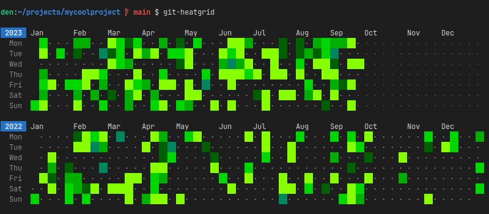

<p align="center">
    
</p>

<p align="center">
    Visualize git commits as a calendar heatmap
</p>

<p align="center">
    
</p>

## Features

- Written in bash with a minimum of dependencies
- Fast (all commits processed at once)
- Themes: **dark, light, 8colors** + you can create your own themes
- Customizable (See [Configuration](#configuration))
- Filtering by author and committer

## Dependencies

Most likely you already have all these utils installed.

- bash 5.0+
- coreutils (date, sort, uniq)
- git

## Installation

### Linux (Manual)

```bash
# Download the script to the local bin directory and make it executable
curl https://raw.githubusercontent.com/denshakhov/git-heatgrid/main/git-heatgrid -o ~/.local/bin/git-heatgrid
chmod +x ~/.local/bin/git-heatgrid
```

## Usage

```bash
cd /path/to/your/repo
git-heatgrid

# or
git-heatgrid /path/to/your/repo
```
For convenience, add this alias to your `~/.bashrc` file:

```
alias hg='git-heatgrid'
```

To get more help, run `git-heatgrid -h`:

```
USAGE
    git-heatgrid [OPTIONS] [REPOSITORY]

ARGUMENTS
    REPOSITORY  Path to the git repository (default: current directory)

OPTIONS
    -a pattern Limit the commits output to ones with author header lines that
               match the specified pattern (regular expression). With more than
               one -a, commits whose author matches any of the given
               patterns are chosen.
    -c         Show number of commits
    -d         Show days of month (Use it with -w3 for better readability)
    -e         Hide years without commits
    -l         Show the legend
    -m pattern Same as -a option but for a committer
    -s number  Weeks start on number (default: 1, available: 1 .. 7,
               1 is Monday and 7 is Sunday)
    -t name    Theme name (default: dark, available: dark, light, 8colors)
    -w number  Cell width (default: 2, available: 2, 3)
    -y number  Number of years to print (default: 0 - all)

    -h         Display this help and exit
    -V         Output version information and exit

FILES
    The configuration files are read in the order given below, with last value
    found taking precedence over values read earlier.

    /etc/git-heatgrid/config.conf
        System-wide configuration file.

    $XDG_CONFIG_HOME/git-heatgrid/config.conf
        User-specific configuration file. When the XDG_CONFIG_HOME environment
        variable is not set or empty, $HOME/.config is used as $XDG_CONFIG_HOME.
```

## Configuration

Download the [example config](https://github.com/denshakhov/git-heatgrid/blob/main/config.conf) to either `/etc/git-heatgrid/config.conf` or `~/.config/git-heatgrid/config.conf` and change it to suit your needs. It's heavily commented and contains all available options with their default values.

```bash
mkdir ~/.config/git-heatgrid
curl https://raw.githubusercontent.com/denshakhov/git-heatgrid/main/config.conf -o ~/.config/git-heatgrid/config.conf
```

## Similar projects

- https://github.com/james-stoup/heatwave/ (Python) - Visualize your git commits with a heat map in the terminal.
- https://github.com/ammsa/Githeat (Python) - Interactive heatmap for your git repos
- https://github.com/abdullah-alaadine/git-commits-visualizer (Go) - Allows developers to scan their local Git repositories and generate a visual contributions graph.

## License

MIT